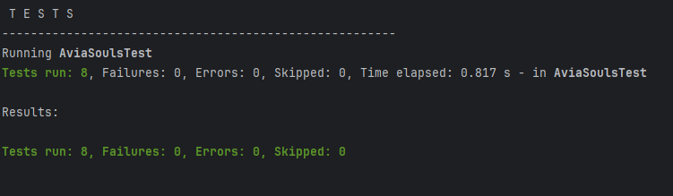

# Программа поиска авиабилетов

_Цель:_ научиться сортировать объекты и сравнивать их с помощью Comparable и Comparator; протестировать реализованный код

# Входные данные

- дан класс Ticket с предложением перелета на основе параметров: город вылета, город прилета, цена, время вылета, время прилета
- дан менеджер Aviasouls, который умеет хранить и искать билеты
- необходимо в Ticket реализовать метод compareTo с применением интерфейса Comparable для сортировки билетов по цене от меньшей к большей
- в методе search класса Aviasouls необходимо добавить сортировку результата по возрастанию цены билетов
- необходимо создать класс TicketTimeComparator для сравнения двух билетов по продолжительности перелета по возрастанию 
- необходимо реализовать в менеджере метод searchAndSortBy(String from, String to, Comparator<Ticket> comparator) для поиска билетов и сортировки по логике компаратора
- необходимо протестировать реализованные методы compareTo, searchAndSortBy, сортировку в методе search

# Выходные данные

- реализованы необходимые методы с применением интерфейсов
- автотесты в AviaSoulsTest завершены без ошибок
- успешная сборка

mvn clean verify

